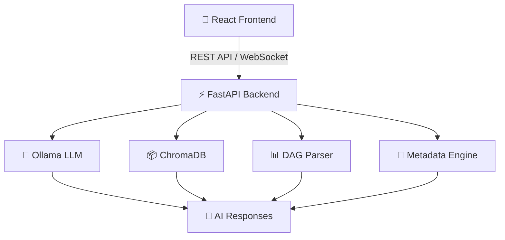

# 🚀 GenAI Data Engineering Assistant

AI-powered assistant for Data Engineering workflows using **RAG**, **Ollama**, **FastAPI**, and **React**.

This platform helps data engineers instantly understand pipelines, DAGs, SQL queries, metadata, lineage, and system health through a conversational AI interface — eliminating the need to constantly switch between GitHub, Airflow, SQL editors, monitoring dashboards, and documentation tools.

---

# ✨ Project Overview

Modern data engineering teams work in fragmented environments where understanding a pipeline often requires navigating multiple platforms simultaneously.

This project solves that problem by providing a centralized AI-powered assistant capable of:

- Understanding Airflow DAGs
- Explaining SQL queries
- Tracking table lineage
- Extracting metadata
- Monitoring pipeline health
- Answering engineering questions using RAG

The assistant combines semantic search, vector databases, and local LLM inference to deliver contextual and intelligent responses.

---

# 🔥 Core Features

## 🧠 AI-Powered RAG Chatbot

- Retrieval-Augmented Generation (RAG)
- Context-aware responses
- Semantic document search
- Local LLM inference using Ollama
- Intelligent query understanding

---

## 📊 Pipeline & Metadata Intelligence

- DAG metadata extraction
- Airflow workflow parsing
- Table lineage analysis
- Pipeline dependency tracking
- Ownership & metadata discovery

---

## ⚡ Monitoring & Observability

- Data quality monitoring
- Pipeline health visibility
- SLO tracking
- Error diagnostics
- Operational insights

---

## 🎨 Modern User Interface

- ChatGPT-style conversational UI
- Interactive dashboard
- Real-time response streaming
- Responsive dark-themed interface
- Smooth user experience

---

# 🏗️ System Architecture



---

# ⚙️ Tech Stack

| Layer | Technologies |
|---|---|
| Frontend | React, TailwindCSS |
| Backend | FastAPI, Python |
| AI/LLM | Ollama, Llama3, Qwen |
| Vector Database | ChromaDB |
| Parsing | AST, DAG Metadata Extraction |
| Database | SQLite / PostgreSQL |
| Deployment | Docker, GitHub |

---

# 📂 Project Structure

```bash
GenAI_Capstone_Final/
│
├── backend/
│   ├── app/
│   ├── parsers/
│   ├── rag/
│   ├── services/
│   ├── utils/
│   └── main.py
│
├── frontend/
│   ├── src/
│   │   ├── components/
│   │   ├── pages/
│   │   ├── hooks/
│   │   ├── assets/
│   │   └── styles/
│   │
│   └── package.json
│
├── data/
├── docs/
├── screenshots/
├── requirements.txt
└── README.md
```

---

# ⚙️ Installation Guide

## 1️⃣ Clone Repository

```bash
git clone https://github.com/7793993018MAHESH/GenAI_Capstone_Final.git

cd GenAI_Capstone_Final
```

---

## 2️⃣ Backend Setup

```bash
cd backend

python -m venv .venv
```

### Activate Virtual Environment

#### Mac/Linux

```bash
source .venv/bin/activate
```

#### Windows

```bash
.venv\Scripts\activate
```

### Install Dependencies

```bash
pip install -r requirements.txt
```

### Run Backend

```bash
uvicorn app.main:app --reload
```

---

## 3️⃣ Frontend Setup

```bash
cd frontend

npm install

npm run dev
```

---

## 4️⃣ Run Ollama

```bash
ollama serve
```

### Pull LLM Model

```bash
ollama run llama3
```

OR

```bash
ollama run qwen2.5:14b
```

---

# 🧠 Example Questions

```text
• Which pipelines failed today?
• Explain this SQL query
• Show lineage for customer_orders table
• Which DAG depends on this table?
• What are the data quality issues?
• Who owns this pipeline?
• Summarize this Airflow DAG
```

---

# 🚀 Future Enhancements

- Multi-agent AI workflows
- Live Airflow integration
- Snowflake metadata integration
- Slack / Teams integration
- Voice-enabled assistant
- Real-time observability
- MCP architecture support

---

# 📈 Why This Project?

Data engineers often spend significant time switching between tools to understand pipelines, metadata, lineage, and failures.

This project centralizes all those workflows into a single AI-powered assistant that improves:

✅ Productivity  
✅ Incident response  
✅ Pipeline visibility  
✅ Developer experience  
✅ Faster debugging & analysis  

---

# 👨‍💻 Author

### Mahesh

AI & Data Engineering Enthusiast  
Building intelligent developer tools using GenAI

🔗 GitHub:  
https://github.com/7793993018MAHESH

---

# ⭐ Support

If you found this project useful:

- ⭐ Star the repository
- 🍴 Fork the project
- 🛠️ Contribute improvements

---

# 📜 License

This project is licensed under the MIT License.
